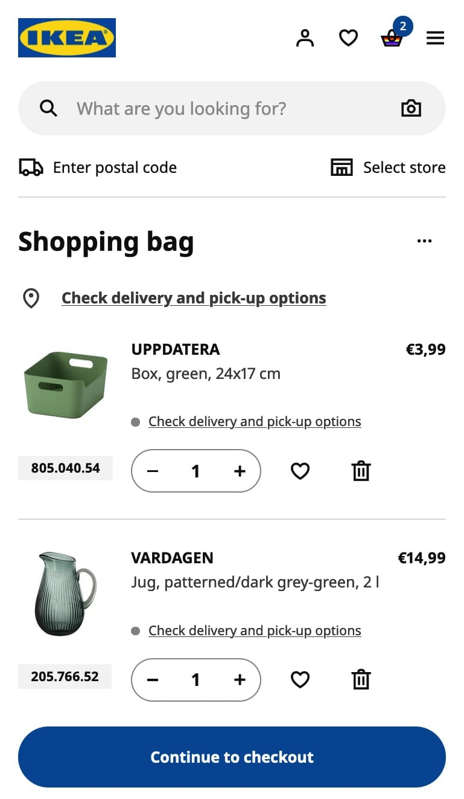

**Session 02 - Exercise B**

# Defining Components for an Entire Page

Examine the following screenshot from the [IKEA](https://ikea.com) website. This page showcases the shopping bag of the online shop.

## Task: Identify Components

Think about the individual UI component, that make up everything shown in the screenshot.

Find a name for each individual UI component and write them down in **PascalCase**.

Use a tool like [Excalidraw](https://excalidraw.com/) to draw rectangles on the screenshot to mark individual UI components or make an abstract representation with pen and paper.
