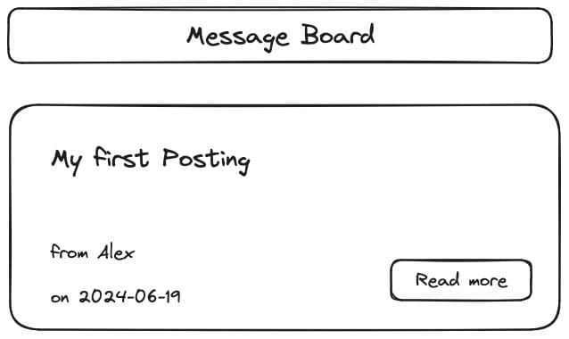

**Session 01 - Exercise G**


# Message Board - Setup

### ⭐️ Message Board Project

This exercise is an integral component of the **Message Board** project, which spans across all React sessions. Each exercise in this project is interconnected, and it is strongly advised that you complete this exercise to ensure a comprehensive understanding as you progress through the series.


## Prerequisites

### Ensure you're in the right directory

In your terminal, move into the directory that stores all exercises you are going to work on during the React course.

Example:

```
cd ~/hcs-react-course
```

### Create a new React app

```
npm create vite@latest react-01g-message-board-setup -- --template react
```

When the installation is complete, follow these steps:

- Change into the directory that was created for this project
    - `cd react-01g-message-board-setup`
- Install all dependencies via `npm`
    - `npm install`
- Open the directory in your IDE
    - Example for VS Code: `code .`
- Start the local development server
    - `npm run dev`
- Open the React app in your browser
    - Example: `http://localhost:5173/`

## Task: Basic setup for the Message Board project

This wireframe should give you an idea, how the app should look like after you completed this exercise.



### Step 1: Create the `Header` component

Create a new component called `Header`, that will be displayed at the top of your page.

The component should render this content:

- The name of the app: "Message Board"

Place the `Header` component in the `App` component to ensure it will be rendered.

### Step 2: Create the `Post` component

Create a new component called `Post`, that will be displayed at the top of your page.

The component should render this content:

- Title of the posting: "My first Posting"
- Author of the posting: Your name
- Date of the posting: "2024-06-19"
- A button with the label: "Read more"

### Step 3: Add styles

Add styles for both components and the page/app itself. You are free to style everything the way you like it.

