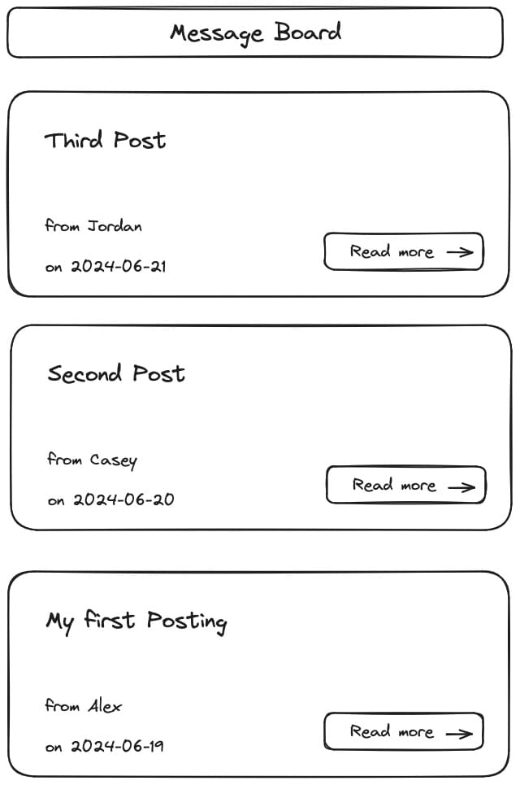

**Session 02 - Exercise H**

# Message Board - Rendering a list of Posts

## ⭐️ Message Board Project

This exercise is an integral component of the **Message Board** project, which spans across all React sessions. Each exercise in this project is interconnected, and it is strongly advised that you complete this exercise to ensure a comprehensive understanding as you progress through the series.

The following wireframe provides a visual reference for the expected layout of the app once you complete this exercise:




## Prerequisites

### Ensure you're in the right directory

In your terminal, move into the directory that stores all exercises you are going to work on during the React course.

Example:

```
cd ~/hcs-react-course
```

### Create a copy of the previous project

Before starting this exercise, make a copy of the previous exercise "react-01g-message-board-setup" and rename it to "react-02h-message-board-post-list". Use the following command to do this:

```
cp -R react-01g-message-board-setup react-02h-message-board-post-list
```

After copying the project, follow these steps:

- Change into the directory that was created for this new project:
    - `cd react-02h-message-board-post-list`
- Open the directory in your IDE:
    - Example for VS Code: `code .`
- Start the local development server:
    - `npm run dev`
- Open the React app in your browser:
    - Example: `http://localhost:5173/`

### Task 1: Rendering a List of Posts

Use this array to render a dynamic list of posts:

```jsx
const posts = [
  { id: 1, title: "My First Post", author: "Alex", date: "2024-06-19"},
  { id: 2, title: "Second Post", author: "Casey", date: "2024-06-20"},
  { id: 3, title: "Third Post", author: "Jordan", date: "2024-06-21" }
];
```

#### Step 1: Implement Props in the `Post` Component

Currently, the `Post` component outputs static content.  If you place it three times in the `App` component, it would output the same text three times.

Modify it to accept props. This will enable the `Post` component to display variable data, enhancing its flexibility and reusability. Define meaningful prop names based on the content they will represent.

#### Step 2: Dynamically Render in the `App` Component

Incorporate the `posts` data array into the `App` component. Use the `.map()` method to iterate over the array, rendering the `Post` component with data passed via props for each item.

**Hint:** Remember to include a `key` prop when rendering lists from data in React.

**Bonus:** Take a look at the sorting of the posts compared to the wireframe. Think of a way to display the posts in the expected order.

### Task 2: Create a `PostList` Component

#### Step 1: Component Creation

Develop a new `PostList` component that renders a `ul` element containing `li` elements for each post. This component should accept an array of posts as a prop.

Move the rendering logic for the list of posts from the `App` component to the `PostList` component.

#### Step 2: Update the `App` Component

With the list rendering logic shifted to the `PostList` component, integrate this component within the `App` component.

Keep the `posts` data array in the `App` component and pass it as a prop to `PostList`.

#### Step 3: Style the `PostList` Component

Ensure there is appropriate spacing between posts in the UI by applying CSS to the `PostList` component.

Create a separated CSS file for the `PostList` component and import it inside of this component.

### Task 3: Create an `IconButton` Component

#### Step 1: Component Setup

Create the `IconButton` component that renders a `button` element. This component should receive its label via the `children` prop.

#### Step 2: Integrate an Icon

Install the [react-icons](https://react-icons.github.io/react-icons/) library:

```
npm install react-icons
```

Select an icon (such as an arrow) and include it alongside the button label. 

Style the `IconButton` component to neatly arrange the icon with the label. Create a separated CSS file for the `IconButton` component.

Might want to move some button styles from the `Post` component to the `IconButton` component

#### Step 3: Update the `Post` Component

Refactor the `Post` component by replacing the existing `button` element with the new `IconButton` component.

### Task 4: Create a `PostMeta` Component

#### Step 1: Component Development

Establish a new component called `PostMeta` that receives the author and date as props. Select appropriate prop names that reflect their purpose.

#### Step 2: Refactor the `Post` Component

Incorporate the `PostMeta` component within the `Post` component to display the author and date, replacing the current implementation in the `Post` component.

#### Step 3: Adjust CSS for the `PostMeta` Component

As the rendering for the author and date is now handled by a dedicated component, transfer the associated CSS styles to the `PostMeta` component. This ensures that the component is self-contained with its styling.

If you changed the resulting HTML structure in the process, you might need to adjust the CSS too.

### Task 5: Check the Component Tree with "React Developer Tools"

The final component tree should look like this:

- `App`
  - `Header`
  - `PostList`
    - `Post`
      - `PostMeta`
      - `IconButton`
        - (some internal components from `react-icons`)
    - `Post`
      - `PostMeta`
      - `IconButton`
        - (some internal components from `react-icons`)
    - `Post`
      - `PostMeta`
      - `IconButton`
        - (some internal components from `react-icons`)

If the component tree you see in "React Developer Tools" in your browser diverges, please revisit the previous tasks to fix.
