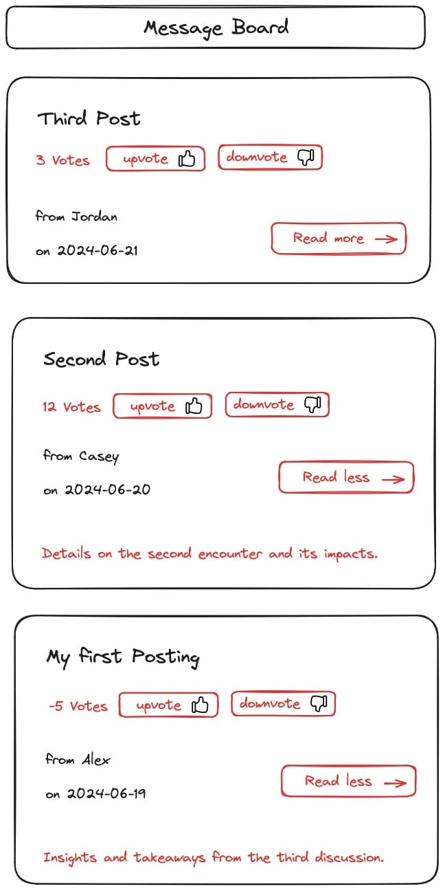

**Session 03 - Exercise H**

# Adding Dynamic Interactions to the Message Board Posts

### ⭐️ Message Board Project

This exercise is an integral component of the **Message Board** project, which spans across all React sessions. Each exercise in this project is interconnected, and it is strongly advised that you complete this exercise to ensure a comprehensive understanding as you progress through the series.

The following wireframe provides a visual reference for the expected layout of the app once you complete this exercise (the updated parts are highlighted in red):

 


## Prerequisites

### Ensure you're in the right directory

Ensure that you're in the directory that contains all exercises for your React course.

Example:

```sh
cd ~/hcs-react-course
```

### Prepare the project environment

To build upon existing project work, create a copy of the "react-02h-message-board-post-list" project and rename it to "react-03h-message-board-interactions".

```
cp -R react-02h-message-board-post-list react-03h-message-board-interactions
```

Change into the directory that was created for this new project:

```sh
cd react-03h-message-board-interactions
```

Install necessary dependencies via `npm`:

```sh
npm install
```

Launch the development server:

```sh
npm run dev
```

Open your project in the browser as prompted, usually at `http://localhost:5173/`.


## Task 1: Update the `Post` Component with Summary and Toggle Interaction


### Step 1: Add Summaries to the Posts Array

Update the `App` component:

```
src/App.jsx
```

Enhance the `posts` array in the `App` component by adding a `summary` field to each post:

```jsx
const posts = [
    { id: 1, title: "My First Post", author: "Alex", date: "2024-06-19", summary: "A brief overview of my first experience."},
    { id: 2, title: "Second Post", author: "Casey", date: "2024-06-20", summary: "Details on the second encounter and its impacts."},
    { id: 3, title: "Third Post", author: "Jordan", date: "2024-06-21", summary: "Insights and takeaways from the third discussion."}
];
```
Feel free to replace the dummy text with your own creative summaries.

### Step 2: Pass the Summary as a Prop
In the `PostList` component, when rendering the `Post` components, pass the `summary` from each post as a prop.

```
src/components/PostList.jsx
```

Pass the `summary` prop:

```jsx
<Post
    //... other props
    summary={post.summary}
/>
```

### Step 3: Enable Conditional Summary Display
Modify the `Post` component.

```jsx
src/components/Post.jsx
```

The summary should be hidden initially.  The summary should only show when the user clicks the "Read more" button.

Implement this using a boolean state that controls the visibility of the summary.

Don't forget to import the `useState` hook.

```jsx
import { useState } from "react";
```

### Step 4: Add Toggle Functionality to Button
Create a function in the `Post` component that toggles the visibility state. Connect this function to the "Read more" button, so it changes the state when clicked. 

**Hint:** This is tricky!

If you just add the `onClick` prop to the `<IconButton>`, it will not work.

You need to have `onClick` as a prop within the `IconButton` component and pass it to the `<button>`.

If you are having trouble with this, just add an addition button to the `Post` component for the toggle functionality.


### Step 5: Dynamically Change Button Text
Adjust the "Read more" button text to switch to "Read less" when the summary is visible and vice versa, reflecting the state of the content display.

Using conditional rendering to solve this.

## Task 2: Implement Voting for Posts

### Step 1: Initialize Vote Count State
For each post, set up a state to track its vote count, starting from zero.

### Step 2: Add Voting Buttons

Add two buttons for upvoting and downvoting.

The upvote button should increase the vote count by `1`. The downvote button should decrease the vote count by `1`.

Consider using icons from `react-icons` to enhance the user experience, making the buttons more intuitive and attractive. Think about reusing the `IconButton` component for the upvote and downvote buttons.

You can even pass components as props:

```jsx
<IconButton icon={<PlusIcon />}>upvote</IconButton>
<IconButton icon={<MinusIcon />}>downvote</IconButton>
```

The `icon` prop can be rendered like any other value: `<button>{icon}</button>`

If you are having trouble with this, just use a regular HTML `<button>` instead of `<IconButton>`.

### Step 3: Manage Vote Changes
Write functions to handle clicks on the upvote and downvote buttons, updating the vote count state.

### Step 4: Show Current Vote Count
Make sure the current vote count is displayed near the voting buttons.

## Task 3: Enhance Styling

Apply CSS to beautify and organize the layout and presentation of the posts, summaries, and voting buttons, ensuring a clean and user-friendly interface.
